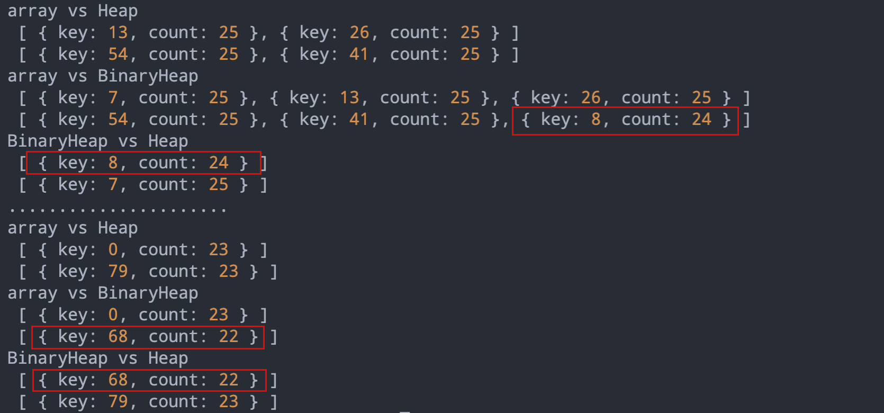

# Binary Heap Different Result

Run this in the command line:

```
deno run main.js
```
Output:


`main.js` is three different ways of [top-k-frequent-elements](https://leetcode.com/problems/top-k-frequent-elements/) implementation.
  1) use Array
  2) use `deno_std` BinaryHeap
  3) use npm package [Heap](https://www.npmjs.com/package/heap)

But the `deno_std` BinaryHeap seems has a different result.It also cannot pass all the leetcode test cases.

